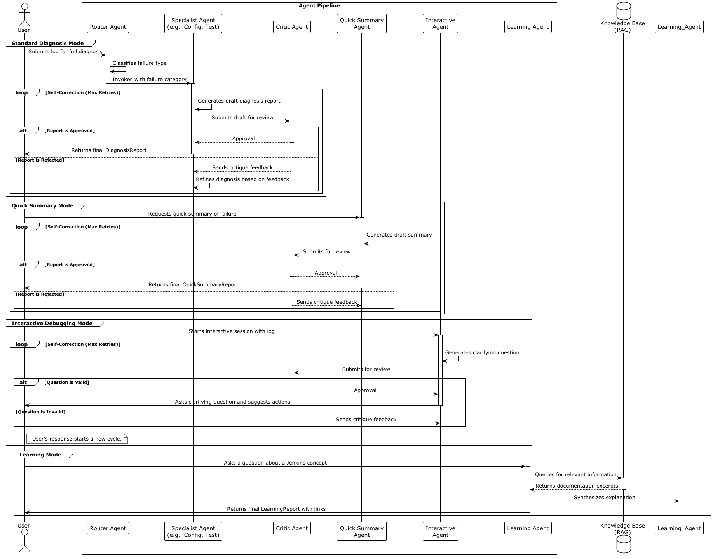

# Jenkins AI Diagnostic Agent

Some part of the foundational backend is now complete, providing a flexible architecture for the agentic system.

## Current Progress & Key Features

*   **Multi-Modal Agent Architecture:** The system is built around distinct operating modes, allowing users to choose their preferred method of interaction:

    *   **Standard Diagnosis:** A full-featured pipeline that identifies a failure category, performs a detailed analysis, and suggests a fix. Includes a self-correction loop with a "critic" agent.
    *   **Quick Summary:** For expert users who need a fast, high-level pointer to the root cause.
    *   **Interactive Debugging:** A conversational mode where the agent asks clarifying questions to guide the user through the debugging process.
    *   **Learning Mode:** An educational mode designed to explain Jenkins concepts and errors to beginners.

*   **LLM Provider Support:** A centralized catalog (`llm_catelog.py`) provides a plug-and-play architecture for integrating a wide range of LLM providers, from commercial endpoints like OpenAI, Google, and Groq to self-hosted models via vLLM and Ollama(These are yet to be added).

*   **Type-Safe and Validated Configuration:** The entire system is built on Pydantic models, ensuring that all configurations from the LLM catalog to agent response formats are type-safe, validated, and self-documenting.

*   **Testing:** A `pytest` suite (`tests.py`) to continuously validate the agent factory, ensuring that all agents are created with the correct prompts techniques, tools, and response models.

## Prompts: Ensuring Reliability

While powerful, many LLMs or SLMs especially smaller, faster models can struggle to consistently adhere to strict output formats like a JSON schema. A failure to produce valid JSON can break the entire agentic pipeline.

To mitigate this, we have adopted a highly explicit and structured prompt format. Each prompt clearly defines:

1.  **Role:** The agent's persona and area of expertise.
2.  **Process:** The internal algorithm the agent should follow.
3.  **Core Rules:** Hard constraints to guide its behavior.
4.  **Schema & Example:** This is the most critical component. Each prompt provides not only the formal **JSON Schema** of the expected output but also a concrete **Example Output**.

This two-pronged approach acts as a powerful form of in-context learning, could lead to improving the model's ability to generate valid, parseable JSON responses across a wide range of models.

## Next Steps

With the core agent framework in place, the next development phase will focus on enhancing the agent's diagnostic capabilities by building out its key tools:

*   **MCP Tool Development:** Implement a new tool to interact with the [MCP Server Plugin](https://github.com/jenkinsci/mcp-server-plugin). This will allow the agent to gather structured build metadata and artifacts directly from Jenkins, moving beyond simple log analysis.
*   **Lightweight RAG Implementation (Already made currently testing):** Develop the `KnowledgeBaseTools` using a lightweight RAG (Retrieval-Augmented Generation) system. This will be powered by an indexed collection of Jenkins documentation, enabling the **Learning Mode** agent to provide accurate, context-aware explanations.