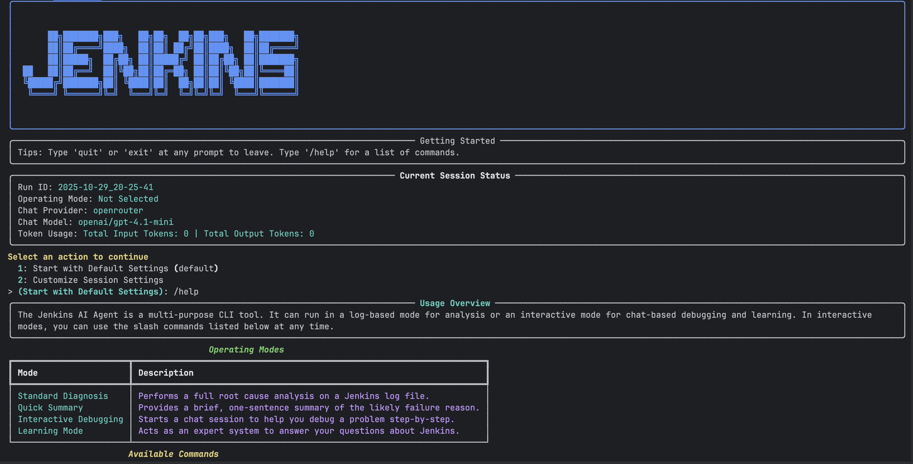
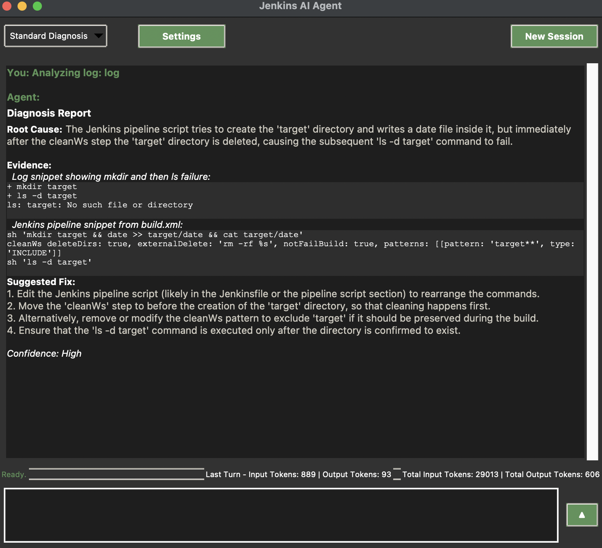
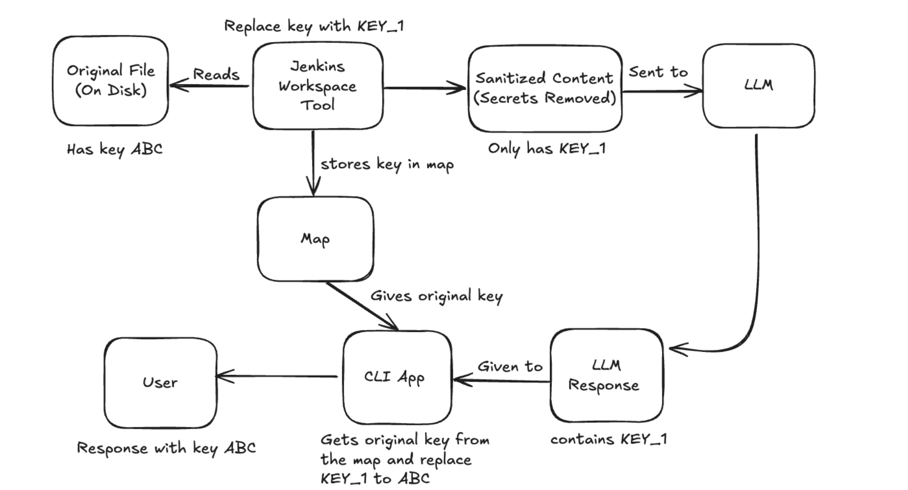
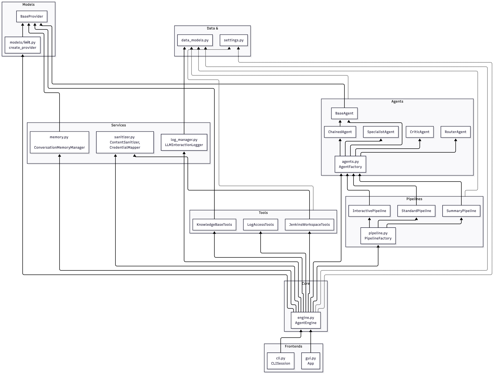
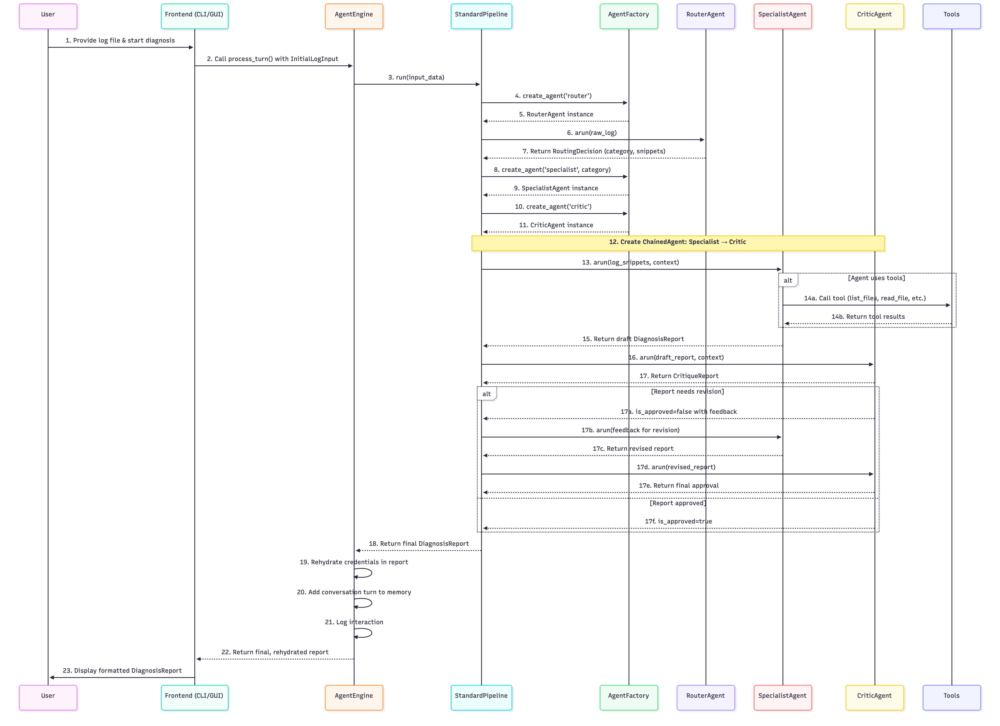

# jenkins-domain-LLM (GSoC 2025)

**Project:** Jenkins Domain specific LLM based on actual Jenkins usage using ci.jenkins.io data

[](https://github.com/your-repo/jenkins-ai-agent)
[](https://opensource.org/licenses/MIT)
[](https://www.python.org/downloads/)

## Project Overview

This repository contains the development work for the Google Summer of Code 2025 project focused on building a LLM-powered assistant to diagnose Jenkins build failures.

The initial proposal centered on fine-tuning a domain-specific LLM. However, the project has since evolved to prioritize a more flexible and robust **universal agentic architecture**. This approach lowers the barrier to entry for users and developers, supports a wider range of models (including any future fine-tuned Jenkins LLM), and provides a more extensible foundation for future development. The core goal remains the same: to create a powerful tool that makes debugging Jenkins failures faster and more intuitive.


## Core Features

*   **Multi-Agent Root Cause Analysis:** Utilizes a chain of specialized AI agents (Router, Specialist, Critic) to perform in-depth analysis of Jenkins build logs.
*   **Interactive Debugging:** Offers a chat-based interface for step-by-step guidance and troubleshooting.
*   **Dual-Layer Conversation Memory:** Remembers context from both the current session (short-term) and all past sessions (long-term) to provide highly relevant and personalized responses.
*   **Tools:** Can interact with the Jenkins workspace, query a knowledge base, and even connect to a live Jenkins instance via the MCP plugin.
*   **Secure by Design:** Features an automatic sanitization pipeline to scrub credentials, API keys, and secrets from any data before it is sent to an LLM.
*   **Multi-Provider Support:** Fully configurable to use a wide range of LLM providers, including Google, OpenAI, Cohere, Mistral, Fireworks, and local Sentence Transformers.

## In Action

The agent provides a clean and intuitive command-line interface for all its operations.

**Command-Line Interface (CLI):**


**Proposed Future Graphical User Interface (GUI):**


## Core Architectural Principles

The entire system is built on four fundamental principles that ensure it is powerful, flexible, and secure.

#### 1. Configuration-Driven
The agent's behavior is not hardcoded. Every critical aspect from the available LLM providers to the specific tools an agent can use is defined in a central `config/config.yaml` file. This allows for easy extension and modification without changing the core code.

#### 2. Modular & Extensible
The project features a strict separation of concerns, making it highly maintainable and easy to expand:
- **Models (`/models`):** Each LLM provider is a self-contained class with a consistent interface, loaded dynamically by a factory.
- **Tools (`/tools`):** The agent's capabilities are encapsulated in modular tools.
- **Agents (`agents.py`):** A central `AgentFactory` assembles agents on demand, combining models and tools based on the configuration.
- **Pipelines (`/pipelines`):** High-level, multi-step workflows are defined independently, allowing for complex behaviors like critique-and-refinement loops.

#### 3. Secure by Design
The agent operates with a security-first mindset. All user-provided data, such as build logs and workspace files, is passed through a robust sanitization pipeline.

- **Sanitization:** The `ContentSanitizer` automatically scrubs credentials, API keys, and other secrets.
- **Mapping & Rehydration:** Secrets are replaced with safe placeholders (e.g., `[AWS_KEY_1]`). These are only converted back to their original values in the final report shown to the user, ensuring the LLM never has access to sensitive information.



#### 4. Intelligent Memory
The agent features a dedicated, two-layered memory system to maintain context across conversations.
- **Short-Term Memory:** Remembers the last few turns of the current session for immediate context.
- **Long-Term Memory:** All conversations are vectorized and stored in a dedicated FAISS index and SQLite database. This allows the agent to retrieve semantically relevant memories from any past session to inform its current reasoning.

## Architecture Diagrams

#### Component Interaction

This diagram illustrates the key classes and modules and how they are wired together within the application.



#### Data Flow Sequence

This sequence diagram shows the step-by-step flow of data for a single user query in an interactive session, from input to memory retrieval, LLM generation, and final storage.



## Project Structure Deep Dive

The project is organized to promote modularity and a clear separation of concerns.
```markdown
📁 jenkins-domain-LLM/
├── 📄 .env.example
├── 📄 .gitignore
├── 📄 README.md  # The main project README file.
├── 📄 requirements.txt  # A list of all the python dependencies for the project.
├── 📁 Jen_agent  # The main application source code.
│   ├── 📄 .env
│   ├── 📄 agents.py  # Core agent logic and the AgentFactory.
│   ├── 📄 cli.py  # Main application entrypoint using Typer.
│   ├── 📄 data_models.py  # Pydantic models for all structured data (reports, settings, etc.).
│   ├── 📄 engine.py
│   ├── 📄 gui.py
│   ├── 📄 log_manager.py
│   ├── 📄 memory.py  # Implements the dual-layer conversation memory system (SQLite + FAISS).
│   ├── 📄 pipeline.py  # Factory for creating the correct pipeline based on the selected mode.
│   ├── 📄 prompt_examples.py
│   ├── 📄 sanitizer.py
│   ├── 📄 settings.py  # Pydantic models for loading and validating config.yaml.
│   ├── 📄 tests.py
│   ├── 📁 Benchmark  # Scripts for running and analyzing agent performance benchmarks.
│   │   ├── 📄 BENCHMARK_REPORT.md
│   │   ├── 📄 analyze_benchmark.py
│   │   ├── 📄 curate_benchmark_files.py
│   │   ├── 📄 generate_questions.py
│   │   ├── 📄 run_benchmark.py
│   │   └── 📁 benchmark_data
│   │       └── ... # Contains raw data, questions, and results for performance benchmarking.
│   ├── 📁 RAG_scripts  # Utility scripts, e.g., for ingesting documents into the knowledge base.
│   │   └── 📄 ingest_docs.py
│   ├── 📁 commands  # Logic for interactive slash commands (e.g., /help, /view).
│   │   ├── 📄 __init__.py
│   │   ├── 📄 base.py
│   │   └── 📄 handlers.py
│   ├── 📁 config  # Centralized configuration for the entire application.
│   │   └── 📄 config.yaml
│   ├── 📁 docs
│   │   ├── 📄 Jenkins-agent.md
│   │   ├── 📄 agent_interactions.png
│   │   └── 📄 agent_interactions.puml
│   ├── 📁 models  # LLM provider integrations and the factory for creating them.
│   │   ├── 📄 __init__.py
│   │   ├── 📄 base.py
│   │   ├── 📄 utils.py
│   │   └── ... (and all provider client folders)
│   ├── 📁 pipelines  # Defines high-level, multi-step agentic workflows (Operating Modes).
│   │   ├── 📄 __init__.py
│   │   ├── 📄 base.py
│   │   └── ... (and all pipeline files)
│   ├── 📁 prompts  # All system and tool prompts, organized by agent/pipeline.
│   │   └── ... (and all prompt folders)
│   ├── 📁 test
│   │   └── ... # Contains sample log files and test artifacts for local development.
│   ├── 📁 tools  # Agent capabilities (e.g., file access, knowledge base query).
│   │   ├── 📄 __init__.py
│   │   └── ... (and all tool files)
│   └── 📁 ui  # (Future) Code for the graphical user interface.
│       └── 📄 tkinter_display.py
├── 📁 Prototype
│   └── ... # Contains early-stage prototype code and test files.
├── 📁 Prototype_CLI
│   └── ... # Contains an early command-line interface prototype.
└── 📁 Reports
    └── ... # Contains all generated diagrams, assets, and architectural documents.
```
## Getting Started

Follow these steps to set up and run the Jenkins AI Agent on your local machine.

#### 1. Prerequisites
- Python 3.10 or higher
- Git

#### 2. Clone the Repository
```bash
git clone https://github.com/chiruu12/jenkins-domain-LLM
cd jenkins-domain-LLM/jen_agent
```

#### 3. Set Up Virtual Environment
```bash
python -m venv venv

# Activate it
# On macOS/Linux:
source venv/bin/activate
# On Windows:
.\venv\Scripts\activate
```

#### 4. Install Dependencies
```bash
pip install -r requirements.txt
```

#### 5. Configure the Agent
The agent's configuration is managed through `config/config.yaml` and environment variables.

1.  **Review `config.yaml`**: The default settings are pre-configured to use the local `sentence-transformer` provider for memory. You can customize providers, models, and other settings here.
2.  **Set API Keys**: Create a `.env` file in the project root to store your API keys. Copy the format from the example below:

    ```.env
    # .env.example
    GOOGLE_API_KEY="your-google-api-key"
    OPENAI_API_KEY="your-openai-api-key"
    COHERE_API_KEY="your-cohere-api-key"
    MISTRAL_API_KEY="your-mistral-api-key"
    FIREWORKS_API_KEY="your-fireworks-api-key"
    ```

#### 6. Initialize the vector store
Before running the application for the first time, you need to initialize the vector store for the Agentic RAG.

Run this script in the root of the project to create and populate the vector store:
```bash
./scripts/vector_store.sh
```

#### 7. Run the Application

- ##### CLI 
```bash
python cli.py
```

- ##### UI
```bash
python gui.py
```

## Usage

When you launch the application, you will be guided through a series of prompts to:
1.  Choose whether to use default settings or customize the session (e.g., select a different LLM provider).
2.  Select an operating mode (e.g., `Standard Diagnosis`, `Interactive Debugging`).

Once in an interactive mode, you can type `/help` at any time to see a list of available slash commands for managing your session.

## License
This project is licensed under the MIT License. See the [LICENSE](LICENSE) file for details.
