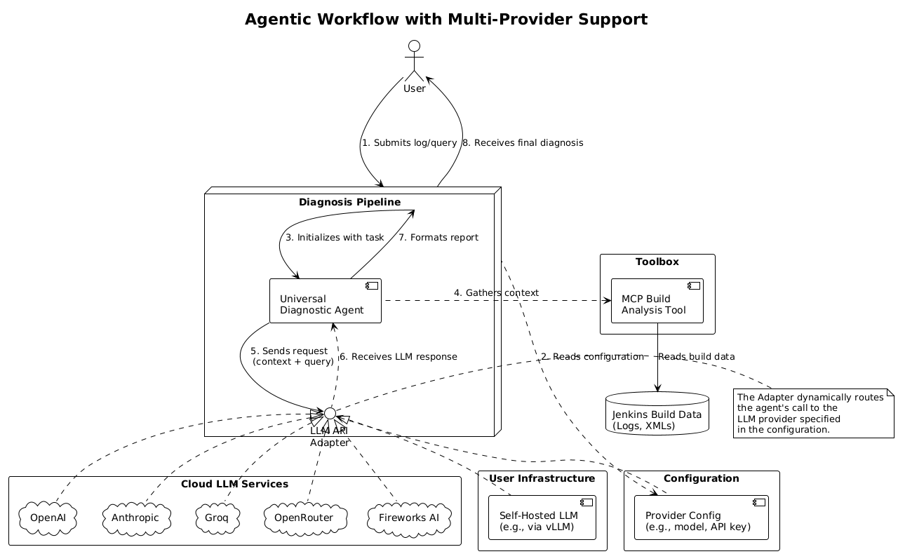
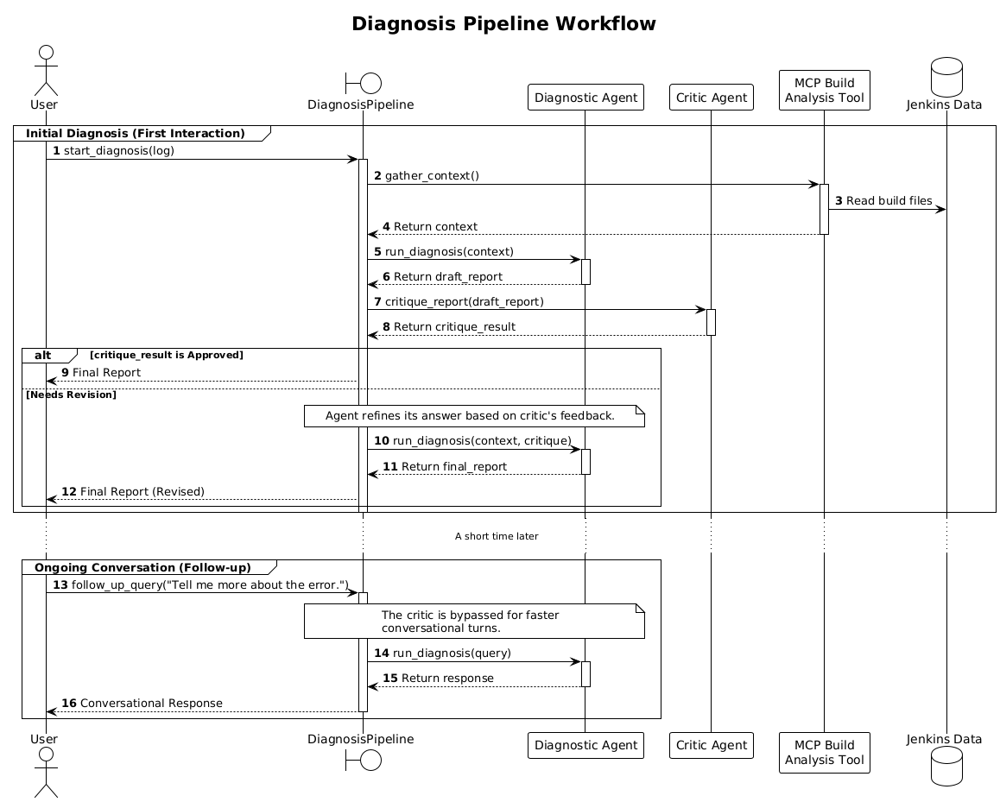

### **Project Plan: Pivoting to Agentic Architecture**

This document outlines the revised project plan for GSoC'25 project Jenkins Domain specific LLM based on actual Jenkins usage using ci.jenkins.io data. The primary objective is to transition from the static, finetuned LLM prototype to a flexible, universal agentic architecture. This shift prioritizes robustness, user choice, and extensibility, laying the groundwork for a more powerful and maintainable diagnostic tool. Which can be evolved over the time and would help lower the entry level bar for jenkins.

#### **1. Core Architecture**
*   **Multi-Provider LLM Support:** The system will be built to seamlessly integrate with multiple LLM providers not limited to OpenAI such as Anthropic’s Claude and others. This flexibility allows users to choose models based on their specific requirements for performance, cost-efficiency, or data privacy. I also plan to explore mechanisms that allow users to integrate their own self-hosted LLMs such as those powered by vLLM or similar frameworks. This would give users full control over model deployment and they will be able to use there own fine tuned LLMs Also this would keep the fine tuned llm for jenkins open as we can use it with the agent.

*   **Native Tool-Use Requirement:** Any LLM integrated into the system must support native function calling (tool use) as a core capability. This is essential for enabling the agent to carry out autonomous, context-aware tasks and conduct meaningful investigations.
    (The tools are re-tried upto 3 times if they fail)
#### **2. Pipeline Refactoring: The `DiagnosisPipeline` Class**

The current `run_diagnosis_pipeline` function will be refactored into a `DiagnosisPipeline` class to better manage state and handle interactions more intelligently.

*   **Differentiated Interaction Handling:** The pipeline will distinguish between the initial analysis and subsequent interactions.
    *   **Initial Diagnosis:** The `critic_agent` will be invoked *only* on the first response generated by the primary diagnostic agent. This ensures the initial, most critical analysis is of the highest possible quality.
    *   **Asymmetrical Model Strategy:** We will explore using a powerful, state-of-the-art model (e.g., Gemini 2.5 Pro) for the `critic_agent` and a smaller, faster model for the main agent. This strategy optimizes for both quality and cost-efficiency.
    *   **Follow-up Conversation:** After the initial critiqued report, the user will converse directly with the main agent, bypassing the critic for a faster, more fluid interaction.

##### **2.1. Agent Operating Modes**

To cater to different user needs and expertise levels, the agent will support several operating modes, which can be selected by the user:

*   **Standard Diagnosis Mode:** The default mode. Provides a comprehensive report including a clear root cause, supporting evidence extracted from logs and files, and a detailed, actionable suggested fix.
*   **Quick Summary Mode:** For experienced users who need a fast pointer. The agent will return only a one or two-sentence summary of the most likely root cause, omitting the detailed evidence and solution steps.
*   **Interactive Debugging Mode:** A conversational approach where the agent, instead of providing a full report, asks clarifying questions to narrow down the problem. For example: "I've detected a `compilation error`. Should I first examine the `changelog.xml` for recent code changes or inspect the `pom.xml` for dependency issues?"
*   **Learning Mode:** Aimed at users new to Jenkins. In addition to the fix, the agent explains the underlying concepts of the error (e.g., "What is a `DependencyConflictException` and why does it occur?") and provides links to relevant Jenkins documentation.

#### **3. Tooling Enhancements**

*   **Recursive File System Access:** The `read_file_from_workspace` tool will be upgraded to recursively navigate subdirectories. This is essential for locating test reports and other critical files often nested within folders like `target/reports/`.
*   **MCP-based Build Analysis Tool:** We will develop a new tool which will be used to intract with [MCP plugin](https://github.com/jenkinsci/mcp-server-plugin). with a few more methods .This tool will consolidate data gathering into two primary functions:
    1.  `get_build_artifacts(build_id)`: Fetches relevant files for a given build.
    2.  `get_build_metadata(build_id)`: Retrieves structured metadata (parameters, result, duration, etc.).
*   **Custom Tool Extensibility:** The architecture will allow users to integrate their own MCP-compliant plugins. We will provide documentation and a clear template specifying the schema and instructions the agent needs to effectively use custom tools.
*   **Sandboxing:** The file access tool will operate within a strict sandbox, programmed to access only files in the user approved workspace directory. 
The tool's core logic will automatically block any requests attempting to use path traversal techniques (`../`) or absolute paths. 
This boundary is enforced at the code level, creating a reliable safeguard that operates independently of the LLM's behavior and protects against potential prompt injection attacks.
Furthermore, if an access violation is attempted, the tool will return an explicit error message to the agent, such as `Access Denied: Path is outside the designated workspace.` This provides immediate, instructional feedback to the LLM, reinforcing the operational boundaries.

To enhance performance and reduce operational costs, we will implement a data-driven strategy for minimizing log size before it is sent to the LLM.

*   **Analysis:** We will analyze the `ci.jenkins.io` dataset to identify common boilerplate, redundant log sections, and patterns that can be summarized without losing critical diagnostic information.
*   **Experimentation & Validation:** Several reduction techniques will be developed and tested. Their effectiveness will be measured by comparing the diagnostic accuracy of the agent using shortened logs versus full logs. The goal is to find the optimal balance between token reduction and information fidelity.
*   **User Configuration:** The final implementation will provide users with options to control the level of log reduction (e.g., 'Basic', 'Aggressive').
*   **API Key Sanitization:** To prevent accidental leakage of sensitive credentials, all data (logs, file contents) will be passed through a sanitization filter before being sent to the LLM. This layer will use regular expressions to detect common API key and secret token formats. Upon detection, the actual secret is replaced with a descriptive placeholder (e.g., `<GEMINI_API_KEY>`, `<JENKINS_SECRET_TOKEN>`). This ensures the LLM can reason about the presence of a credential without ever having access to the real secret, safeguarding user data.

#### **5. Enhanced Observability and Diagnostics Logging**
To ensure transparency and provide deep insights into the agent's behavior, we will implement a robust, structured logging system. 
For a complex agentic system, simple logs are insufficient; we need detailed observability to debug issues, track performance, and monitor costs effectively.
*   **Structured Logging:** Every diagnostic session will generate a comprehensive log containing structured data for each critical step of the pipeline. 
    These logs will also be formatted as JSON objects (User will have option to download both) ,making them both machine readable for automated analysis and easy for human inspection.

*   **Key Metrics to be Logged:** Each log entry for an LLM interaction will capture:
    *   **LLM Provider & Model:** The specific model used for the generation (e.g., `openai/gpt-4o-mini`).
    *   **Tool Calls:** The name of the tool function called by the agent and the parameters it was called with.
    *   **Token Usage:** A precise count of input and output tokens for the interaction.
    *   **LLM Latency:** The time taken to receive a response from the model API.
    *   **Agent Response:** The final, user-facing output generated by the agent.

*   **User-Downloadable Logs:** The complete diagnostic log for each session will be downloadable directly from the user interface. 
This gives users an understanding exactly how the agent arrived at its conclusion, providing full transparency and aiding in any manual debugging efforts. 
Furthermore, this structured format lays the groundwork for future integration with monitoring systems like Prometheus for tracking system health and costs at scale.

#### **6. Evaluation Strategy**

To ensure the diagnostic agent provides high quality, reliable, and useful responses 
across different configurations, we will implement a robust evaluation framework 
centered on an "LLM-as-a-Judge" approach.

Another directory will be created to store the evaluation code , results and the data used for evaluation.

*   **Automated Evaluation with a Judge LLM:**
We will leverage a powerful, state-of-the-art model (e.g., Gemini 2.5 Pro) to act as an impartial evaluator. This "judge" will be given the agent's generated response along with the original context and will score the output based on key criteria such as correctness, clarity, evidence-based reasoning, and the actionability of its suggestions.

*   **Human-in-the-Loop Validation:**
To maintain the integrity of this process, the LLM-generated evaluations will be subject to human oversight. Mentors will periodically review the judge's scoring to ensure it aligns with expert human judgment. This step is crucial for preventing metric drift and grounding our results in real-world utility.

*   **Comprehensive Performance Benchmarking:** Our evaluation will be conducted across three primary axes to create a comprehensive performance matrix:
    1.  **LLM Backends:** We will systematically test the performance of various supported LLMs (e.g., from OpenAI, Anthropic, Groq) as the primary diagnostic agent.
    2.  **Agent Operating Modes:** Each LLM's performance will be evaluated across all defined operating modes (Standard Diagnosis, Quick Summary, Debugging, and Learning Mode).
    3.  **Token Sanitization Benchmarking:** We will benchmark various log sanitization techniques from minimal cleaning to more aggressive token reduction to measure their 
impact on diagnostic accuracy, response latency, and cost.

The outcome of this comprehensive evaluation will be a detailed performance guide. This guide will empower users by providing clear data on how different LLMs perform in various modes and with different levels of log sanitization. It will allow them to make informed decisions by balancing diagnostic accuracy with operational costs and speed.

#### **7. Evolving Plan**

This plan outlines the core objectives for the project. It is a living document that will evolve as we make progress, gather data from our experiments, and receive feedback. The primary focus remains on building a robust, flexible, and genuinely useful tool for the Jenkins community.
